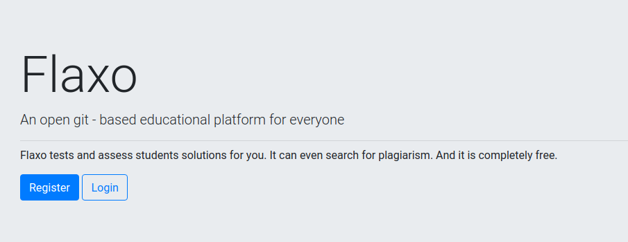
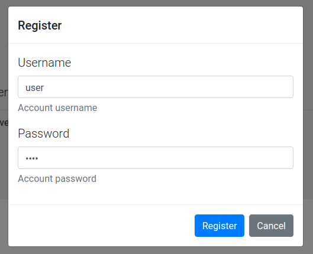

# Flaxo account

Flaxo account is an essential part of the platform. 
Each of the users should have one in order to access courses.

> **Account credentials should be cared in a secure manner**.
 An account can have associated external services credentials which cannot be accessed by the intruder directly 
 but can be used in an indirect way to harm the original user external accounts.

## Create an account

If you don't have an account you should create one following the instructions below.

1. To create a new account you should go the Flaxo home page.

2. Click on the **Register** button. Registration popup will appear.

3. Fill **Username** and **Password** fields and press **Register** button. 
The registration popup will be closed and you will be redirected to courses page.

## Authorize with an existing account

If you do have an account you should login following the instructions below.

1. To login into an existing account you should go the Flaxo home page.

2. Click on the **Login** button. Login popup will appear.
3. Fill **Username** and **Password** fields with your credentials and press **Login** button. 
The login popup will be closed and you will be redirected to courses page.
