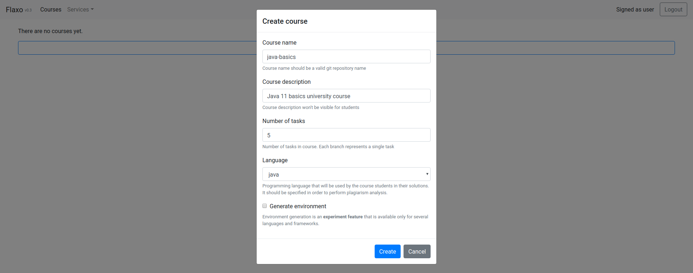
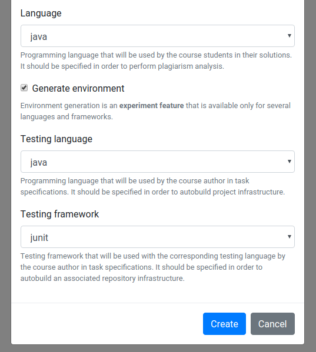
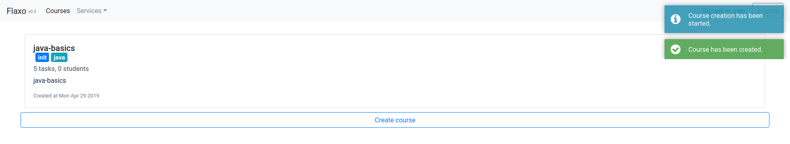

# Creating a course

One you've connect your *GitHub* account in Flaxo you can create your first educational course! 
To do so click on the **Create course** button on the courses page which is enabled now.
Course creation popup will appear.

In the appeared course creation popup you fill **Course name**, **Number of tasks** and **Language** fields.

Moreover you can enable **Generate environment** checkbox to use an *experiment feature* of course environment 
generation. 
Once enabled **Testing language** and **Testing framework** fields will appear.

To create course click on **Create** button in the course creation popup. 
The popup will be closed and after several seconds the course will appear on the courses page along with the 
corresponding notifications.

