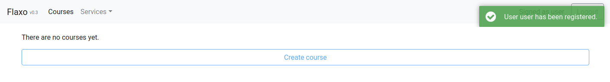

# External services

Once you've registered you will be redirected to the courses page. Welcoming notification will also inform you that
registration's finished successfully.

## Courses page

Courses page contains all the course that you've created. By now it is empty, of course. Nevertheless once created 
course will always be on the courses page.

Courses page can be accessed from most of the Flaxo pages using the **Courses** button in the page header. Courses
page also contains **Create course** button which is disabled now. The problem lies in the *external services* which
are not yet authorized.

## External services

External services authorization can be accessed after clicking **Services** button in the page header.

Some of the external services *GitHub* and *Codacy* have yellow circles right near them in the external 
services dropdown. At the same time *Travis* don't have a yellow circle.
Basically, it means that *GitHub* and *Codacy* services require additional actions from you to connect them to Flaxo.

### GitHub

*GitHub* is a web-based hosting service for version control using Git. It is completely free for public use. And for 
the moment *GitHub* is the only Git service that Flaxo supports. 

#### Authorization

Authorization only requires you to have a *GitHub* account.
To connect your *GitHub* account to your Flaxo account click on the **GitHub** in the services dropdown.

Click **Sign in with GitHub** to initiate an OAuth authorization process. You will be redirected several times and
after the confirmation you will be redirected back to Flaxo application.

If you open the services dropdown again you will see that *GitHub* has lost its yellow circle.

And if you click on **GitHub** again you will see that you are already authorized with your *GitHub* account.
By the way there is a **Logout from GitHub** button which is not working in the current release.

### Codacy

*Codacy* is a web-based static analysis service which encapsulates a lot of static analysis tools. It performs an
automated code quality analysis and produces a unified overall code quality summary.

#### Authorization

Authorization only requires you to be authorized in *Codacy* with your *GitHub* account.
To connect your *GitHub* account to your Flaxo account click on the **Codacy** in the services dropdown.

Click on the **codacy account settings** button with the mouse middle button. The *Codacy* account settings will be
opened in a new tab. Go to the new tab and copy the generated API token.

Turn back to the Flaxo browser tab, put copied API token in the **Codacy token** input and click 
**Update codacy token**. The notification with the corresponding message should appear.

Now if you refresh the page and open services dropdown you'll see that *Codacy* has lost its yellow circle.

And if you click on **Codacy** again you will see that you are already authorized with your *Codacy* account.
You can update your codacy token in this popup at any time.

### Travis

*Travis* is a web-based continuous integration service which is free for open-source projects. It can run tests in the
repository branches or its pull requests to validate that the written code does that it should do.

#### Authorization

Authorization only requires you to be authorized in *Travis* with your *GitHub* account.
No additional actions are required from the user. 
Flaxo handles the authorization using *GitHub* authorization to access *Travis* authorization.
