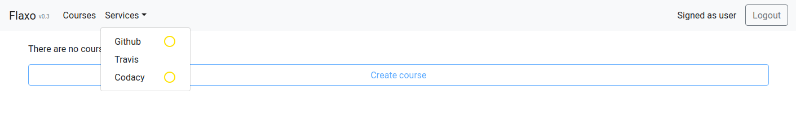
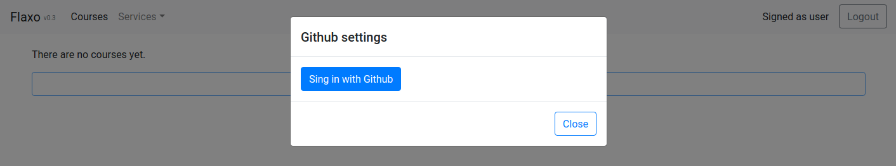
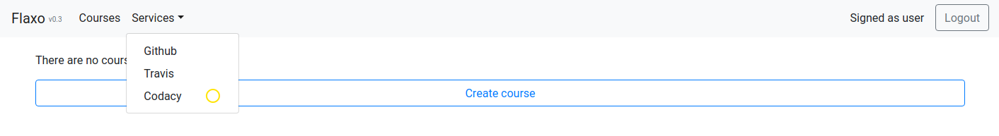
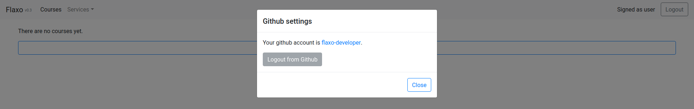
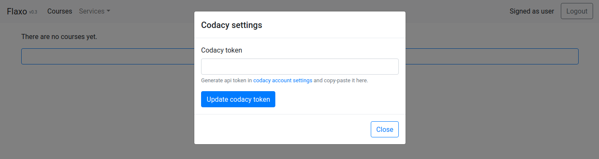
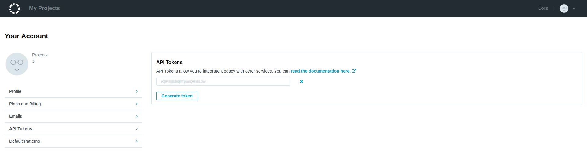
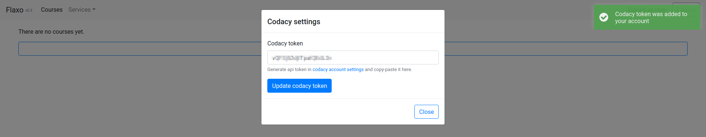
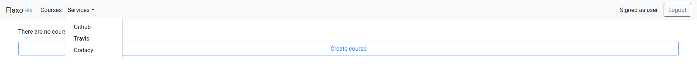
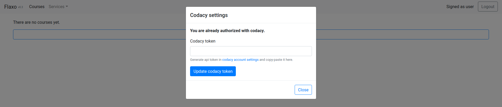

# External services

External service is a web service that Flaxo uses to host courses, validate solutions and do other important things.
Most of the services should be connected to Flaxo account manually. 
Different external services uses different authorization mechanisms described later in the document.

To see a full list of external services click **Services** button in the page header.
Services dropdown will appear.

If an external service is not connected to your Flaxo account it will have a yellow circle right next to it in 
services dropdown.
Some of the external services connections are performed automatically and therefore part of the services don't 
have associated yellow circles even if the user didn't connect it. 

F.e. on the picture above it can be seen that *GitHub* and *Codacy* external services are not connected to 
the Flaxo account but *Travis* is connected or will be automatically connected.

## GitHub

*GitHub* is a web-based hosting service for version control using Git. It is completely free for public use. And for 
the moment *GitHub* is the only Git service that Flaxo supports. 

### Connect account

To connect your *GitHub* account to the Flaxo account follow the instructions below.

1. Click on the **GitHub** in the services dropdown. *GitHub* settings popup will appear.

2. Click **Sign in with GitHub** to initiate an OAuth authorization process. You will be redirected several times and
after the authorization confirmation you will be redirected back to Flaxo.

3. If you open the services dropdown again you will see that *GitHub* has lost its yellow circle.

  
And if you click on **GitHub** in the services dropdown again you will see that you are already authorized with 
your *GitHub* account.

### Disconnect from account

Disconnecting from GitHub account is not supported yet despite the fact that the corresponding button is present.

## Codacy

*Codacy* is a web-based static analysis service which encapsulates a lot of static analysis tools. It performs an
automated code quality analysis and produces a unified overall code quality summary.

### Add or update token

You should be authorized in *Codacy* with your *GitHub* account to authorize it in Flaxo.
To connect your *Codacy* account to the Flaxo account follow the instructions below.

1. Click on the **Codacy** in the services dropdown.
*Codacy* settings popup will appear.

2. Click with the middle mouse button on the **codacy account settings** link in the *Codacy* settings popup to open
your *Codacy* account settings in a new browser tab. Go to the new tab and copy the generated API token.

3. Turn back to the Flaxo browser tab, put copied API token in the **Codacy token** field and click 
**Update codacy token**.
The notification declaring that API token was added to your account should appear.

4. Now if you refresh the page and open services dropdown you'll see that *Codacy* has lost its yellow circle.

  
And if you click on **Codacy** in the services dropdown again you will see that you are already authorized with 
your *Codacy* account.

## Travis

*Travis* is a web-based continuous integration service.
It can run tests in repository branches and pull requests.

### Autoconnection

You should be authorized in *Travis* with your *GitHub* account to authorize it in Flaxo.
Travis account is connected to Flaxo account automatically using the connected *GitHub* account token.
Flaxo connects *Travis* account when *user starts its first course*.

## Gitplag

*Gitplag* is a web service for plagiarism analysis of git repositories.
By default Flaxo deployment includes embedded *Gitplag* components and the service is used for plagiarism analysis.

Currently *Gitplag* uses default server *GitHub* authorization which requires additional access rights in case of
private courses plagiarism analyses.
